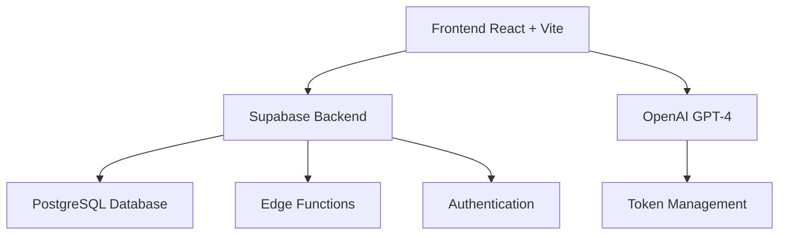

# 🎓 ProfAssist

**L'IA au service des enseignants** - Suite complète d'outils intelligents pour automatiser les tâches administratives pédagogiques.

[](https://reactjs.org/)
[](https://www.typescriptlang.org/)
[](https://supabase.com/)
[](https://openai.com/)

---

## 🚀 **Aperçu**

ProfAssist est une application web moderne qui révolutionne le quotidien des enseignants en automatisant leurs tâches administratives les plus chronophages grâce à l'intelligence artificielle.

### ✨ **Fonctionnalités principales**

- **🎯 Appréciations personnalisées** - Génération automatique d'appréciations détaillées et synthétiques
- **📊 Synthèses de bulletins** - Analyse et résumé automatique de bulletins scolaires (PDF + OCR)  
- **💬 Communications professionnelles** - Rédaction de messages et réponses adaptés au contexte éducatif
- **📚 Séances pédagogiques** - Création complète de séances avec export PDF et archivage
- **🏦 Banques personnalisées** - Stockage et recherche dans vos appréciations et séances sauvegardées
- **📰 Veille éducative** - Flux RSS d'actualités pédagogiques en temps réel
- **💳 Système de tokens** - Gestion transparente de la consommation IA avec plans flexibles

---

## 🏗️ **Architecture**



### 🛠️ **Stack technique**

| Couche | Technologies |
|--------|-------------|
| **Frontend** | React 18, TypeScript, Vite, TailwindCSS |
| **Backend** | Supabase (Auth, Database, Edge Functions) |
| **Base de données** | PostgreSQL (Supabase) |
| **IA** | OpenAI GPT-4 Turbo |
| **État global** | Zustand |
| **Routing** | React Router DOM |
| **Validation** | Zod + React Hook Form |
| **PDF/OCR** | Tesseract.js, jsPDF, pdf.js |
| **Paiements** | Stripe |

---

## 🚦 **Démarrage rapide**

### Prérequis
- Node.js 18+ 
- npm ou yarn
- Compte Supabase
- Clé API OpenAI
- Compte Stripe (pour les paiements)

### Installation

1. **Cloner le projet**
   ```bash
   git clone https://github.com/votre-username/profassist.git
   cd profassist
   ```

2. **Installer les dépendances**
   ```bash
   npm install
   ```

3. **Configuration environnement**
   
   Créer un fichier `.env` :
   ```env
   # Supabase
   VITE_SUPABASE_URL=your_supabase_url
   VITE_SUPABASE_ANON_KEY=your_supabase_anon_key
   SUPABASE_SERVICE_ROLE_KEY=your_service_role_key
   
   # OpenAI
   VITE_OPENAI_API_KEY=your_openai_api_key
   
   # Stripe
   VITE_STRIPE_PUBLISHABLE_KEY=your_stripe_publishable_key
   STRIPE_SECRET_KEY=your_stripe_secret_key
   ```

4. **Initialiser la base de données**
   ```bash
   # Appliquer les migrations Supabase
   npx supabase db push
   ```

5. **Lancer en développement**
   ```bash
   npm run dev
   ```

### Commandes disponibles

```bash
npm run dev          # Serveur de développement
npm run build        # Build de production
npm run preview      # Prévisualisation du build
npm run lint         # Linting du code
npm run type-check   # Vérification TypeScript
```

---

## 📊 **Structure de la base de données**

### Tables principales

| Table | Description |
|-------|-------------|
| `profiles` | Profils utilisateurs + solde tokens |
| `subjects` | Matières d'enseignement |
| `criteria` | Critères d'évaluation par matière |
| `appreciations` | Appréciations générées et taguées |
| `lessons_bank` | Banque personnelle de séances |
| `articles` | Articles RSS de veille éducative |

### Relations

```sql
subjects (1) --> (N) criteria
profiles (1) --> (N) appreciations
profiles (1) --> (N) lessons_bank
```

---

## 💰 **Système de tokens**

### Consommation moyenne
- **Appréciation** : ~3000 tokens
- **Synthèse de bulletin** : ~1800 tokens  
- **Communication** : ~1000 tokens
- **Séance pédagogique** : ~3500 tokens

### Plans disponibles
| Plan | Tokens | Prix base | Avec banque |
|------|--------|-----------|-------------|
| Professeur | 200k | 3,50€ | 4,50€ |
| Professeur Principal | 400k | 6,00€ | 7,00€ |

---

## 🚀 **Déploiement**

### Netlify (Recommandé)

1. **Connecter le repository**
2. **Configurer les variables d'environnement**
3. **Build settings** :
   ```
   Build command: npm run build
   Publish directory: dist
   ```

### Variables d'environnement en production
Assurez-vous de configurer toutes les variables d'environnement dans votre plateforme de déploiement.

---

## 🧪 **Tests**

```bash
npm run test          # Tests unitaires
npm run test:e2e      # Tests end-to-end
npm run test:coverage # Couverture de code
```

---

## 📝 **Fonctionnalités détaillées**

### 🎯 Génération d'appréciations
- Interface intuitive avec notation par critères
- Génération simultanée version détaillée et synthétique
- Système de tags pour classification
- Sauvegarde et recherche dans banque personnelle

### 📊 Synthèse de bulletins  
- Upload de bulletins PDF
- OCR automatique avec Tesseract.js
- Résumé intelligent des commentaires
- Export et partage des synthèses

### 💬 Communications
- Assistant IA pour messages aux parents/collègues
- Ton adapté au contexte (formel, bienveillant, etc.)
- Génération de réponses à partir de messages reçus

### 📚 Générateur de séances
- Formulaire structuré (niveau, pédagogie, durée...)
- Export PDF professionnel
- Sauvegarde automatique en banque personnelle
- Recherche full-text dans les séances

---

## 🛡️ **Sécurité**

- Authentification Supabase avec JWT
- Validation des données avec Zod
- Chiffrement des communications
- Conformité RGPD
- Paiements sécurisés via Stripe

---

## 🤝 **Contribution**

1. Fork le projet
2. Créer une branche feature (`git checkout -b feature/AmazingFeature`)
3. Commit vos changements (`git commit -m 'Add: Amazing Feature'`)
4. Push sur la branche (`git push origin feature/AmazingFeature`)
5. Ouvrir une Pull Request

---

## 📄 **Licence**

Ce projet est sous licence MIT. Voir le fichier `LICENSE` pour plus de détails.

---

## 🆘 **Support**

- **Documentation** : [video](https://youtu.be/whV_svG5S3g)
- **Email** : contact-profassist@teachtech.fr  


---

## 🗺️ **Roadmap**

### V2.0 (Q2 2025)
- [ ] Application mobile React Native
- [ ] API publique pour intégrations
- [ ] Notifications push
- [ ] Interface administrateur avancée

### V2.1 (Q3 2025)  
- [ ] Intégration ENT (Pronote, etc.)
- [ ] Mode collaboratif équipes
- [ ] Analytics avancées
- [ ] Templates de séances communautaires

---

**Fait avec ❤️ pour la communauté enseignante**

---

### 📈 Statistiques du projet
- **Lignes de code** : ~15,000
- **Composants React** : 45+  
- **Tables base de données** : 8
- **Fonctions Edge** : 3
- **Tests** : 120+
